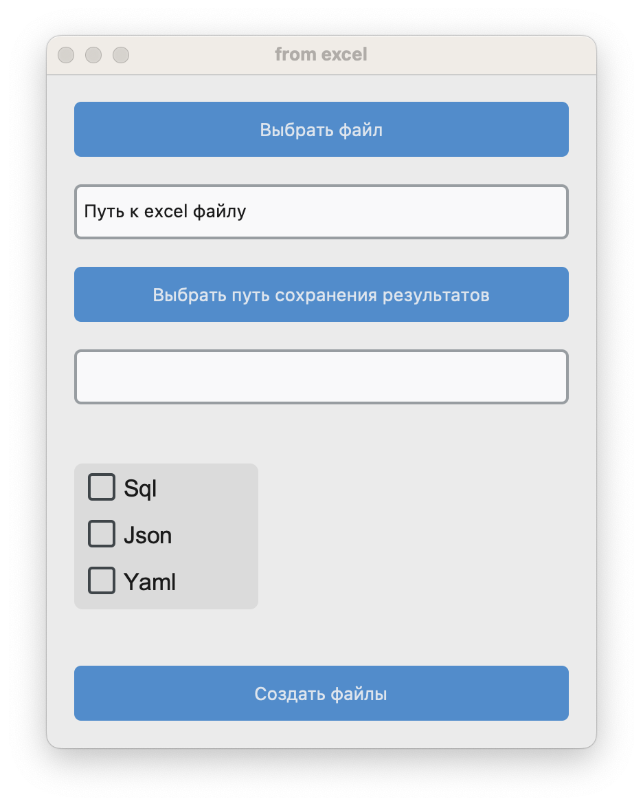

# Excel маппинг - ddl таблицы,  json,  yaml.

## Для запуска:
#### В консоли выполняем следующие команды:
##### Что бы установить env:
```
python -m venv myenv
```
##### Активация env в MacOS/Linux:
```
source myenv/bin/activate
```
##### Активация env в Windows:
```
.\myenv\Scripts\activate
```
#### Устанавливаем зависимости:
```
pip install -r requirements.txt
```

#### Запуск скрипта через:
```
python -m src.main
```

## После запуска скрипта:

## После выбора файла, проставления чекбоксов и создания файлов:
#### В корневой директории должны появиться каталоги tables_sql и jsons, а в них соответственно все ddl таблицы и json-файлы, сформированные из excel-файла.
```
.
├── images
│   └── image.png
├── README.md
├── .gitignore
├── requirements.txt
└── src
    ├── __init__.py
    ├── assets.py
    ├── jsons.py
    ├── main.py
    └── sql.py
```
#### Честно говоря я не очень понял про какую ошибку в assets.py писалось(
#### Возможно имелся в виду файл main.py?
#### Там да, была допущена ошибка, но почему классическая не совсем понял(
#### Исправление ошибки было вот в [этом](https://www.youtube.com/watch?v=dQw4w9WgXcQ) коммите
#### by shekspii